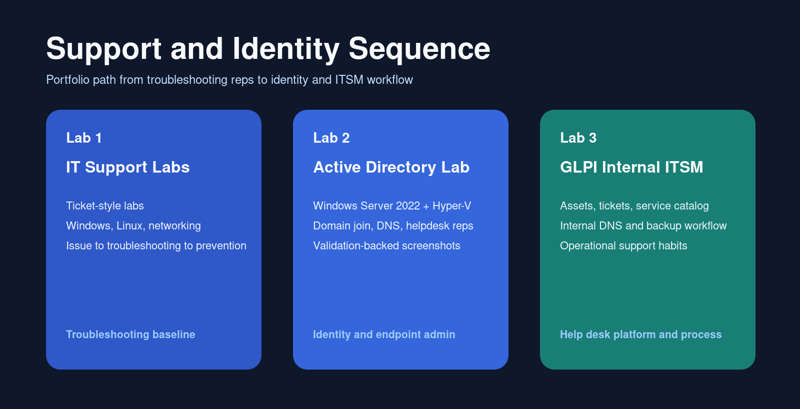
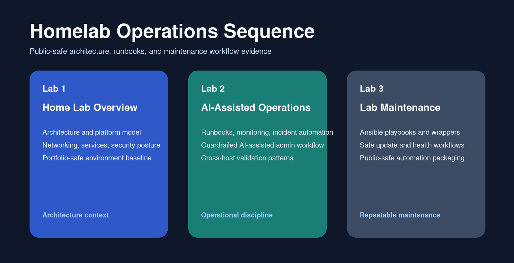
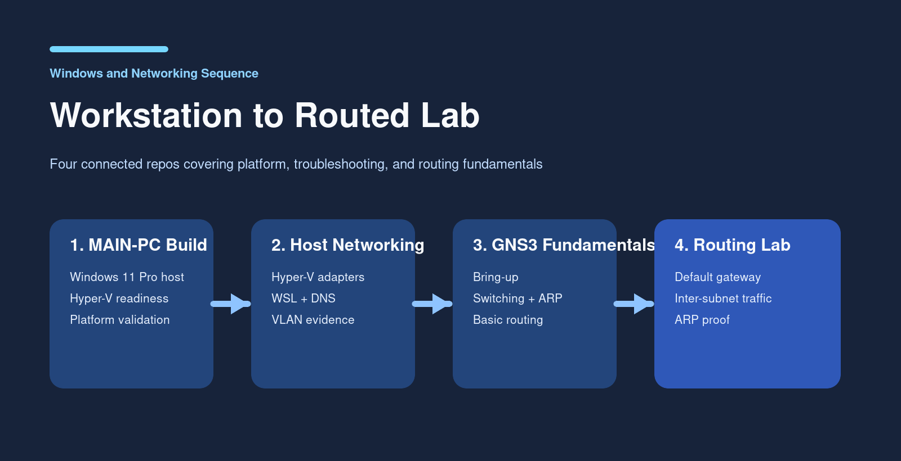
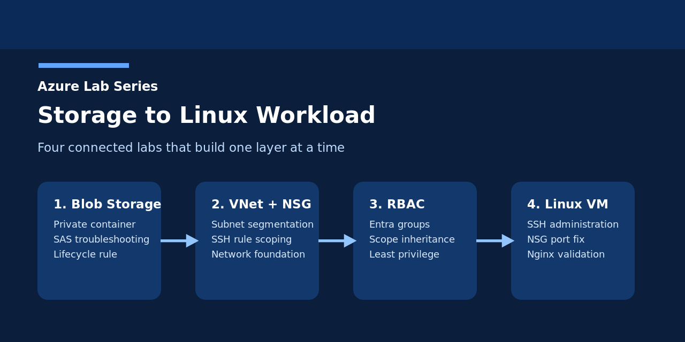

# Dallas Morison

Entry-level IT Support candidate building public proof through hands-on labs in troubleshooting, Windows Server, Azure, networking, Linux, and security-conscious homelab operations.
Last reviewed: April 21, 2026

Social preview asset:
- [portfolio-overview.png](assets/images/portfolio-overview.png)
- [portfolio-overview.svg](assets/images/portfolio-overview.svg)

Location: Seminole, FL  
Target roles: IT Support, Help Desk, Desktop Support

## Contact
- LinkedIn: https://www.linkedin.com/in/dallas-morison-8abb22157/
- Email: dallas.morison.lab@gmail.com

## Start Here

- [IT Support Labs](https://github.com/dallasm92/it-support-labs) - ticket-style troubleshooting across Windows, Linux, and networking.
- [Active Directory Lab](https://github.com/dallasm92/ad-lab-windows-server-2022) - Windows Server 2022 domain controller, DNS, Windows 11 domain join, helpdesk user/group validation, and troubleshooting evidence.
- [GLPI Internal ITSM Lab](https://github.com/dallasm92/glpi-internal-itsm-lab) - internal ITSM deployment with assets, tickets, service catalog, DNS validation, and backup workflow.
- [Support and Identity Sequence](#support-and-identity-sequence) - connected support, Active Directory, and ITSM labs that build from ticket workflow into identity administration and service-desk operations.
- [Homelab Operations Sequence](#homelab-operations-sequence) - connected architecture, operations, and maintenance repos that show how the lab is designed, run, and kept healthy.
- [GNS3 Networking Fundamentals Lab](https://github.com/dallasm92/gns3-networking-fundamentals-lab) - GNS3 bring-up, switching, ARP, subnetting, and basic routing evidence on a Windows Hyper-V host.
- [Windows and Networking Sequence](#windows-and-networking-sequence) - connected endpoint, host-networking, and GNS3 routing labs that build from workstation setup into subnet-level troubleshooting.
- [Azure Lab Series](#azure-lab-series) - connected Azure labs covering storage, networking, RBAC, and Linux VM validation.

## Suggested Pinned Repositories

- `it-support-labs`
- `ad-lab-windows-server-2022`
- `glpi-internal-itsm-lab`
- `gns3-networking-fundamentals-lab`
- `azure-lab-2-virtual-network-nsg`
- `home-lab-overview`

Current live swap still recommended on GitHub:
- unpin `azure-lab-1-blob-storage`
- pin `gns3-networking-fundamentals-lab`

## Core Strengths
- Structured troubleshooting with clear issue isolation, validation, resolution, and prevention notes
- Cross-platform support fundamentals across Windows 11, Windows Server 2022, Linux, networking, and virtualization
- Documentation discipline that turns hands-on work into reviewable portfolio evidence

## Recruiter Guide
- For direct support troubleshooting proof, start with [IT Support Labs](https://github.com/dallasm92/it-support-labs).
- For Windows server and identity work, open [Active Directory Lab](https://github.com/dallasm92/ad-lab-windows-server-2022).
- For hands-on networking fundamentals, start with [GNS3 Networking Fundamentals Lab](https://github.com/dallasm92/gns3-networking-fundamentals-lab) and then the narrower [GNS3 Default Gateway and Basic Routing Lab](https://github.com/dallasm92/gns3-default-gateway-routing-lab).
- For cloud fundamentals, use the [Azure Lab Series](#azure-lab-series).
- For internal service rollout, ticketing, and asset-management workflow, use [GLPI Internal ITSM Lab](https://github.com/dallasm92/glpi-internal-itsm-lab).
- For broader operations and architecture maturity, use [Home Lab Overview](https://github.com/dallasm92/home-lab-overview) and [AI-Assisted Home Lab Operations](https://github.com/dallasm92/ai-assisted-home-lab-operations).

## Hiring Manager Quick View

| Skill area | Best evidence |
|---|---|
| Ticket-style troubleshooting | [IT Support Labs](https://github.com/dallasm92/it-support-labs) |
| Windows Server / Active Directory | [Active Directory Lab](https://github.com/dallasm92/ad-lab-windows-server-2022) |
| ITSM / help desk workflow | [GLPI Internal ITSM Lab](https://github.com/dallasm92/glpi-internal-itsm-lab) |
| Azure fundamentals | [Azure Lab Series](#azure-lab-series) |
| Networking and DNS | [GNS3 Networking Fundamentals Lab](https://github.com/dallasm92/gns3-networking-fundamentals-lab), [Azure VNet/NSG Lab](https://github.com/dallasm92/azure-lab-2-virtual-network-nsg), [Home Lab Overview](https://github.com/dallasm92/home-lab-overview) |
| Linux and operations | [AI-Assisted Home Lab Operations](https://github.com/dallasm92/ai-assisted-home-lab-operations), [Lab Maintenance](https://github.com/dallasm92/lab-maintenance) |

## Support and Identity Sequence

- [Lab 1: IT Support Labs](https://github.com/dallasm92/it-support-labs) - ticket-style troubleshooting across Windows, Linux, and networking with issue-to-prevention documentation
- [Lab 2: Active Directory Lab](https://github.com/dallasm92/ad-lab-windows-server-2022) - Windows Server 2022 domain controller build, DNS, domain join, and helpdesk delegation evidence
- [Lab 3: GLPI Internal ITSM Lab](https://github.com/dallasm92/glpi-internal-itsm-lab) - internal ITSM deployment with asset records, ticket workflow, service catalog validation, and backup discipline

This sequence is meant to read as a support workflow progression: first the troubleshooting reps, then identity and Windows administration, then the service-desk platform used to organize internal support work.

## Homelab Operations Sequence

- [Lab 1: Home Lab Overview](https://github.com/dallasm92/home-lab-overview) - public-safe architecture, networking, monitoring, and environment model documentation
- [Lab 2: AI-Assisted Home Lab Operations](https://github.com/dallasm92/ai-assisted-home-lab-operations) - runbooks, monitoring workflows, backup patterns, and incident-minded automation with explicit guardrails
- [Lab 3: Lab Maintenance](https://github.com/dallasm92/lab-maintenance) - sanitized Ansible maintenance playbooks, wrappers, and safe Linux host update workflows

This sequence is meant to show how the lab is designed and then operated over time: architecture first, day-to-day operational discipline second, and reusable maintenance automation third.

## Windows and Networking Sequence

- [Lab 1: PC Build - MAIN-PC](https://github.com/dallasm92/pc-build-main-pc) - Windows 11 Pro workstation build, virtualization readiness, and host-platform validation for the rest of the lab stack
- [Lab 2: Windows Host Networking, WSL, and VLAN Validation Lab](https://github.com/dallasm92/windows-hyperv-wsl-network-lab) - managed-switch context, Windows route and adapter review, WSL DNS troubleshooting, and layered connectivity validation
- [Lab 3: GNS3 Networking Fundamentals Lab](https://github.com/dallasm92/gns3-networking-fundamentals-lab) - GNS3 bring-up, switching, ARP learning, subnetting boundaries, and first routing tests on the Hyper-V host
- [Lab 4: GNS3 Default Gateway and Basic Routing Lab](https://github.com/dallasm92/gns3-default-gateway-routing-lab) - two-subnet routing with VPCS endpoints, an Alpine router, and default-gateway proof

The sequence is meant to read left to right: build the Windows host, troubleshoot its networking layers, then move into packet-level networking behavior and routed lab design inside GNS3.

## Azure Lab Series

- [Azure Blob Storage Lab](https://github.com/dallasm92/azure-lab-1-blob-storage) - Blob Storage deployment, private container workflow, SAS troubleshooting, and lifecycle management
- [Azure Virtual Network and NSG Lab](https://github.com/dallasm92/azure-lab-2-virtual-network-nsg) - VNet segmentation, public/private subnet design, and SSH-focused NSG rule control
- [Azure Lab 3: RBAC](https://github.com/dallasm92/azure-lab-3-rbac) - Microsoft Entra group-based Reader and Contributor assignments with scope inheritance validation
- [Azure Linux VM and Nginx Lab](https://github.com/dallasm92/azure-lab-4-linux-vm-nginx) - Ubuntu VM deployment, SSH key administration, NSG troubleshooting, and Nginx validation

The series is structured to build one layer at a time: storage first, then networking, then access control, then a Linux workload deployed into the earlier network foundation.

## Why I’m Job-Ready
- I document technical work in ticket format: issue, environment, troubleshooting steps, resolution, and prevention.
- I practice across Windows, Linux, and networking in a real home lab.
- I focus on support fundamentals employers need: incident handling, root-cause analysis, and user-facing communication.
- I use an evidence-first learning model so training supports portfolio proof instead of replacing it.

## Certifications and Training
- Google IT Support Professional Certificate (Coursera) - Completed
- Microsoft IT Support Specialist (Coursera) - Completed
- CompTIA Network+ - In Progress
- Practical Windows PowerShell Scripting (Coursera) - In Progress

## Technical Skills
- Operating Systems: Windows 11, Windows Server 2022, Linux (Ubuntu, Linux Mint)
- Networking: DNS, DHCP basics, connectivity troubleshooting, browser DNS behavior (DoH), Pi-hole
- Systems: Active Directory fundamentals, file shares, mapped drives, SSH, permissions
- Virtualization and Lab Work: Hyper-V, Docker, CasaOS, Raspberry Pi services
- Workflow: Git/GitHub, ticket-style documentation, structured troubleshooting

## Skills With Direct Proof
- Troubleshooting workflow:
  - [IT Support Labs](https://github.com/dallasm92/it-support-labs)
- Active Directory and Windows Server fundamentals:
  - [Active Directory Lab](https://github.com/dallasm92/ad-lab-windows-server-2022)
- Endpoint build, provisioning, and validation:
  - [PC Build - MAIN-PC](https://github.com/dallasm92/pc-build-main-pc)
- GNS3-based networking fundamentals and routing validation:
  - [GNS3 Networking Fundamentals Lab](https://github.com/dallasm92/gns3-networking-fundamentals-lab)
  - [GNS3 Default Gateway and Basic Routing Lab](https://github.com/dallasm92/gns3-default-gateway-routing-lab)
- Windows host networking, WSL, and layered connectivity troubleshooting:
  - [Windows Host Networking, WSL, and VLAN Validation Lab](https://github.com/dallasm92/windows-hyperv-wsl-network-lab)
- Cloud storage fundamentals and access-control troubleshooting:
  - [Azure Blob Storage Lab](https://github.com/dallasm92/azure-lab-1-blob-storage)
- Cloud networking fundamentals and subnet security design:
  - [Azure Virtual Network and NSG Lab](https://github.com/dallasm92/azure-lab-2-virtual-network-nsg)
- Azure access control and least-privilege role assignment:
  - [Azure Lab 3: RBAC](https://github.com/dallasm92/azure-lab-3-rbac)
- Azure Linux administration and cloud workload validation:
  - [Azure Linux VM and Nginx Lab](https://github.com/dallasm92/azure-lab-4-linux-vm-nginx)
- Internal ITSM deployment, asset tracking, and ticket workflow:
  - [GLPI Internal ITSM Lab](https://github.com/dallasm92/glpi-internal-itsm-lab)
- Linux, monitoring, and operations discipline:
  - [Home Lab Overview](https://github.com/dallasm92/home-lab-overview)
  - [AI-Assisted Home Lab Operations](https://github.com/dallasm92/ai-assisted-home-lab-operations)

## Best Evidence Inside The Homelab Repos
- Architecture and networking patterns:
  - https://github.com/dallasm92/home-lab-overview/blob/main/docs/firewall-appliance-selection-notes.md
  - https://github.com/dallasm92/home-lab-overview/blob/main/docs/virtual-firewall-vlan-lab-pattern.md
- Monitoring and operator workflow:
  - https://github.com/dallasm92/ai-assisted-home-lab-operations/blob/main/docs/dashboard-and-host-observability-pattern.md
  - https://github.com/dallasm92/ai-assisted-home-lab-operations/blob/main/docs/immutable-ops-and-incident-automation.md
- Resilience and migration discipline:
  - https://github.com/dallasm92/ai-assisted-home-lab-operations/blob/main/docs/backup-restore-and-resilience-pattern.md
  - https://github.com/dallasm92/ai-assisted-home-lab-operations/blob/main/docs/phased-service-cutover-pattern.md

## Portfolio Projects
- IT Support Labs (primary portfolio): https://github.com/dallasm92/it-support-labs
- Azure Lab Series:
  - Azure Blob Storage Lab: https://github.com/dallasm92/azure-lab-1-blob-storage
  - Azure Virtual Network and NSG Lab: https://github.com/dallasm92/azure-lab-2-virtual-network-nsg
  - Azure Lab 3: RBAC: https://github.com/dallasm92/azure-lab-3-rbac
  - Azure Linux VM and Nginx Lab: https://github.com/dallasm92/azure-lab-4-linux-vm-nginx
- GLPI Internal ITSM Lab: https://github.com/dallasm92/glpi-internal-itsm-lab
- GNS3 Networking Fundamentals Lab: https://github.com/dallasm92/gns3-networking-fundamentals-lab
- GNS3 Default Gateway and Basic Routing Lab: https://github.com/dallasm92/gns3-default-gateway-routing-lab
- Windows Host Networking, WSL, and VLAN Validation Lab: https://github.com/dallasm92/windows-hyperv-wsl-network-lab
- AI-Assisted Home Lab Operations (automation + security + runbooks): https://github.com/dallasm92/ai-assisted-home-lab-operations
- Home Lab Overview: https://github.com/dallasm92/home-lab-overview
- AD Lab (Windows Server 2022): https://github.com/dallasm92/ad-lab-windows-server-2022
- Main PC Build and Validation: https://github.com/dallasm92/pc-build-main-pc
- AI-Assisted IT Support Workflows: https://github.com/dallasm92/ai-assisted-it-support
- Resume Support Map (resume claims -> direct proof): [resume-support-map.md](resume-support-map.md)
- Evidence-First IT Learning: [evidence-first-it-learning.md](evidence-first-it-learning.md)

## Evidence of Hands-On Work
- 8 ticket-style labs currently published in `it-support-labs`
- Cross-platform troubleshooting coverage: Windows labs (4), Linux labs (3), Networking labs (3)
- Active Directory evidence includes 100+ screenshots across server build, AD DS/DNS, client join, helpdesk group validation, and policy troubleshooting.
- Azure evidence includes portal screenshots for storage, VNet/NSG, RBAC, and a documented Linux VM/Nginx workflow.

## Current Focus
- Building deeper Active Directory and Windows endpoint troubleshooting reps
- Strengthening Linux administration and network diagnostics workflow
- Expanding the lab portfolio with more real-world support scenarios and post-incident prevention notes
- Keeping the homelab portfolio public-safe by publishing sanitized workflow notes while retaining raw screenshots and admin UI captures as private-only evidence
